# Assessment: Full Stack Application - Part A

#### By Ling Lee and Ross Baker

## Site

https://www.expensely.tech/

API: http://expensely-backend.herokuapp.com/

## GitHub Repository

**Front-End**: https://github.com/r0ss26/expensely-frontend

**Back-End**: https://github.com/r0ss26/expensely-backend

## Website Purpose

**_The problem_**

Personal finance is often not a priority in the lives of many. This can be due to a number of reasons including lack of financial literacy, the time involvement of tracking expenses or the intimidation factor due to the overwhelming amount of finance advice available. When it comes to personal finance, often simple is better and by being able to track your spending habits over time it is possible to improve your financial position.

**_Our solution_**

Our web app aims to solve this problem by providing a straight forward and intuitive interface for tracking expenses to help our users stay under budget and reach their savings goals.

**_Motivation_**

- Help our users better understand their finances
- Increase their financial position
- Help our users track their expenses
- Help our users to reach their savings goals
- Give our users more control over their finances
- Motivate our users to form good financial habits
- Help our users to save time

**_Implementation_**

Our apps purpose will be achieved by focusing on three different areas: **financial literacy, time savings/convenience and by helping to motivate our users**. This is accomplished in a number of ways:

1. Enable users to save time - the app will utilise simple and easy-to-use interfaces for navigation. It will provide graphical statistics and data visualisations for quick overview. This will save our users from having to laboriously fill out spread sheets or perform calculations to analyse their habits.

2. Increase financial literacy in our users over time - the app will provide daily finance tips in a short and accessible format.

3. Instil motivation to self-manage and improve finances - our app will include a social feed which will allow users to share their progress towards a goal with trusted friends so that they have an incentive to stay on track. This will be supplemented with customizable notifications so that users can be kept updated on their progress and can adjust their spending as necessary.

## Functionality/Features

1. User authentication

   - Users without an account can create an account with username and enter new password.
   - Users with an account can login with a username or email and password.
   - Users are able to logout.
   - Users are able to login through their social media accounts (stretch goal).

2. User settings

   - Users are able to set up their profile with additional information e.g. upload their profile image, add phone number, etc.
   - Users can edit their profile data e.g. change password, change profile image, etc.
   - Users can delete their account.

3. Expenses/Categories Settings

   - Users can add, edit or delete expenses.
   - Users can add, edit or delete expenditure categories.

4. Goal Settings

   - Users can set a weekly or monthly maximum spendings goal.
   - Users can set a weekly or monthly minimum savings goal.
   - Users will be suggested a sensible savings goal.
   - Users can set a spending goal for specific categories e.g. maximum spend of \$100 on eating out.
   - Users can add any debts and add progress towards paying it off.

5. Notifications/Alert:

   - On the first log in of the day users will receive a pop up notification with a daily finance tip.
   - Users will have a “streak” which will track how many times in a row they have reached their savings and spending goal.
   - Users can receive a pop up notification when they have input 50% and 90% of their maximum spending goal.
   - Users can receive a pop up notification when they have input 50% and 90% of their minimum savings goal.
   - Users are able to set notifications if they want to receive daily, weekly or monthly reports.
   - Users will be alerted if the expenses exceed spending goals.
   - Notice pops up on adding, editing or deleting expenses.
   - Notice pops up on adding, editing or deleting categories.
   - Notice pops up when users successfully login or logout.
   - Notice pops up when users successfully create an account.
   - Alert users if they have not been active (future)

6. Search/filter functions:

   - Users are able to search/filter based on name or nature (categories) of expense.
   - Users are able to search/filter expenses based on amount.
   - Users are able to filter expenses over a period of time, eg on a day, a week or month (future).

7. Statistics (average spending, visualisations/graphs)

   - Users can view their spending in different categories in a pie chart.
   - Users can view their spending per day in a line graph.
   - Users can view their income (weekly or monthly) in a line graph.
   - Users can view their net income in a bar graph.
   - Users can view what percentage of their income they have saved.

8. Navigation

   - Users can click a navigation icon which will display a menu that slides out from the side of the screen.
   - From the navigation menu users can navigate to: - Dashboard - User settings page - Goal settings
   - Users can navigate to their finance history which will display the dashboard for previous weeks or months by clicking a back or forward button at the top of their dashboard.

## Target Audience

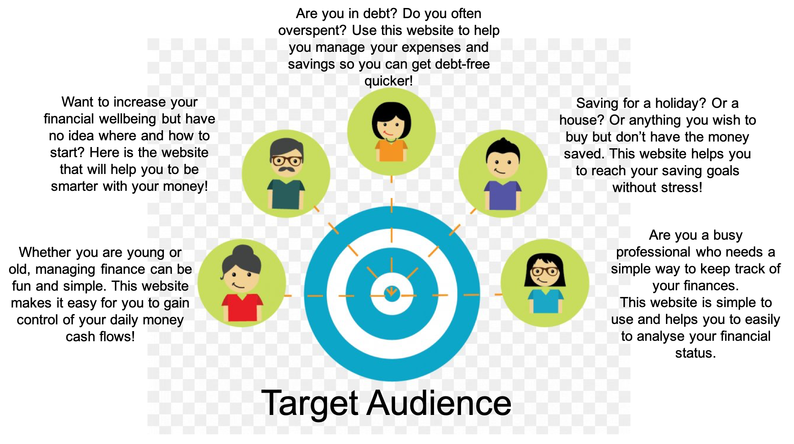 

## Tech Stack

**Front-End**

- HTML5
- CSS3
- JavaScript
- React

**Back-End**

- Node 10.15.3
- Express 4.17
- Mongoose 5.9

**Database**

- MongoDB 4.2
- MongoDB Atlas
- Amazon AWS

**Deployment**

- Heroku cloud platform
- Heroku command line interface
- Netlify
- Netlify command line interface

**Version Control**

- Git
- GitHub

**Project Management**

- Trello
- Discord

## Libraries

TODO - describe libraries used

## Dataflow Diagram

In the web application, the data flow can be visualised at 3 levels. At the top level (Level 0, Figure 1) is an overview of data interaction between the external entity, ie., users and the web application processing system. The next level (Level 1, Figure 2) shows a further breakdown of the processing system. Finally, Level 2 (Figure 3) provides a more detailed look at each subprocesses shown at level 1.

<strong>Figure 1. Level 0 of data flow diagram</strong>

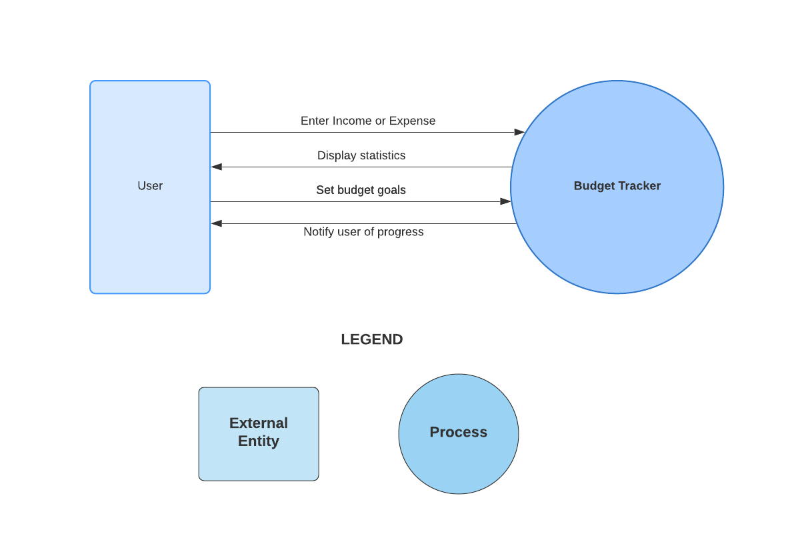

<strong>Figure 2. Level 1 of data flow diagram</strong>

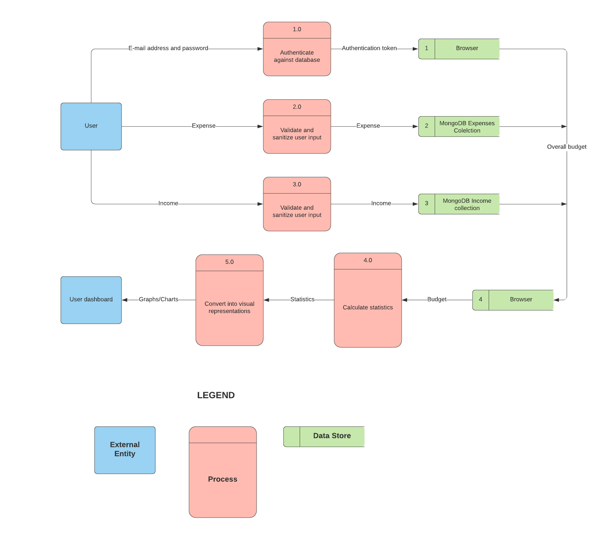

<strong>Figure 3. Level 2 of data flow diagram</strong>

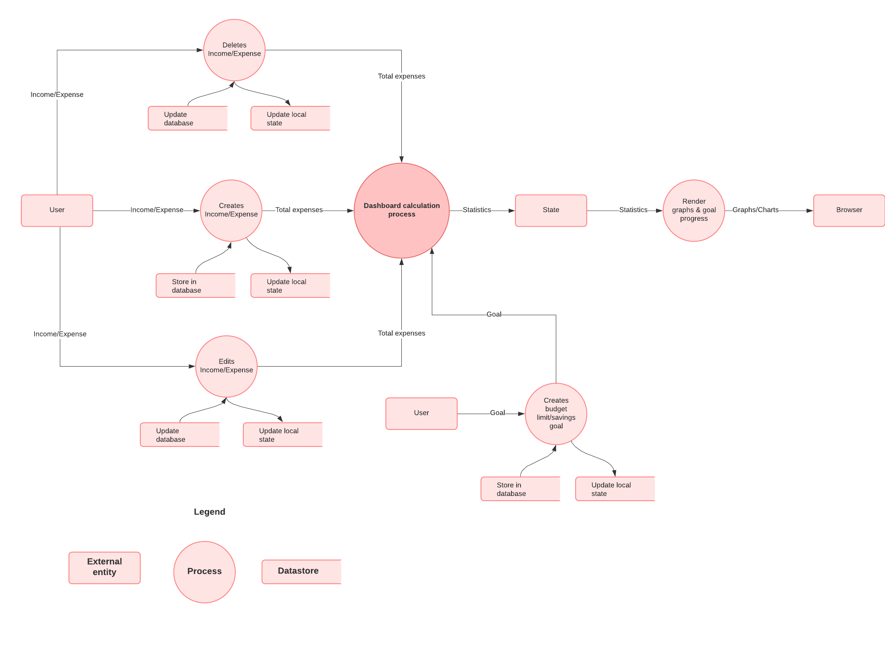

## Application Architecture Diagram

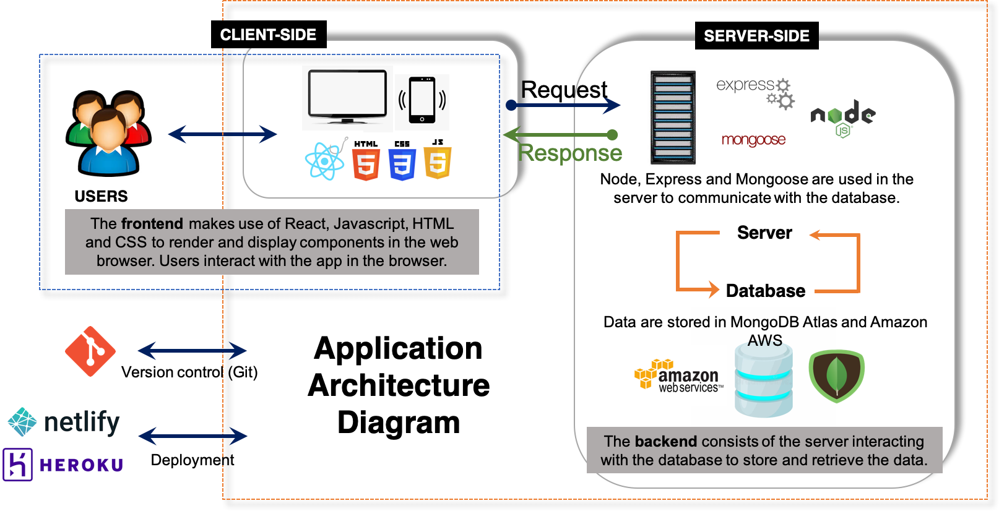

## Personas and User stories

#### Persona 1 - Max

Max is a mid-20’s bartender who is outgoing and sociable. Max is well liked by his colleagues and likes to spend his spare time with friends and family. Max has never been interested in learning about the ins and outs of managing his finances. He wants the quickest and easiest way to get on top of his spending without needing to spend hours reading up on the topic. He finds financial management boring, but enjoys the benefits of being able to track his spending and manage his budget quickly and easily.

**_Goal_**

To track his spending to see where he can cut back, without needing to spend much time learning about finance.

**_Motivations_**

**Save money:** start a savings habit to build his wealth.

**Stop wasting money:** despite earning a good salary he can never seem to save, wants to see where his money is going.

**Efficiency:** Wants to achieve his savings goal with the minimum amount of time investment.

**_User stories_**

As Max I want to be able to track my expenses so that I can see where my money is going.

As Max I want to be able to track my income so that I can evaluate my financial position over time.

As Max I want to be able to associate an expense with a category so that I can track my spending habits categorically.

As Max I want to be able to see a visual breakdown of my spending on different categories so that I can see what I spend most of my money on.

As Max I want to get daily financial tips so that I can learn more about finance without spending too much time on the topic.

#### Persona 2 - Joanna

Joanna is a customer accounts manager, is married with 2 young children. She is a hands-on mother and enjoys spending time with the family when she is not busy at work. Her office is in Sydney central but travel frequently to clients’ offices around Sydney. Although she has a busy life balancing work and family, she likes to be aware of her family expenditure and keeps frequent track of where the money goes. She is tech savvy and keen to make use of technology to make the tracking easy.

**_Goal_**

To be efficient in keeping track of family expenses.

**_Motivation_**

**Awareness:** likes to know what expenses are.

**Organized:** likes to be more organized with how the money is spent.

**_User stories_**

As Joanna, I want to be able to enter data quickly so that I can save time.

As Joanna, I want to be able to organise my data in different categories that so I can have a quick overview or summary.

As Joanna, I want to be able to view graphs and charts of my spending so that I can analyze my data without having to perform complex calculations.

#### Persona 3 - Sarah

Sarah has just finished her Arts degree and working in the media industry. She loves to travel and plans to make at least an overseas trip every year. She likes to spend time with family and also enjoy going out with friends during the weekends. She is active on social media platforms and always keen to share her experiences.

**_Goal_**

To make sure her expenses are within the budget she sets and to meet her saving goals.

**_Motivation_**

**Keen:** likes to experience new things.

**Focus:** ability to follow through a plan.

**_User stories_**

As Sarah , I want to be able to set expenditure budgets for different types of expenses, so I can be better organised and receive notification when I am close to the limit.

As Sarah, I want to be able to share my saving progress with my friends so I will be more motivated to reach my goals.

#### Persona 4 - William

William is in his mid-30s and recently got married. He works as a real-estate agent with steady income. He considers himself a social spender and always welcome nights out with family and friends. He often finds himself spending far more than what he plans to and then ends with a negative credit on his card every month. Since getting married, he wants to have more control of his spending habit and make sure he clears his credit card debt on time.

**_Goal_**

To reduce his over-spending habit and pays off his credit card debt on time.

**_Motivation_**

**Clear credit card debt every month:** does not want to accumulate his credit card debt.

**Not to overspend:** needs to keep track of his expenses and be reminded if he has exceed the budget.

**_User stories_**

As William, I want to be able to set an overall budget limit so that I do not overspend.

As William, I want to be able to view my expenditures by month or by week, so that I can plan my future spending.

As William, I want to see how many days in a row I have logged in, so that I will be motivated to continue using the app.

#### Persona 5 - John

John is a 30 year old single man with no kids. He works in a call center and is comfortable with technology. John doesn’t have any particular finance goals but he enjoys tracking his finances so that he can adjust his spending as he sees fit.

**_Goal_**
To have a generic overview of his finances to optimise it over time.

**_Motivations_**

**Optimisation:** make small changes to his finances which will help his financial position over time.

**Efficiency:** Get the most value without the need for a large time investment or having to customise minute details.

**Understanding:** Have a better understanding of his financial position.

**_User stories_**

As John I want to be able view a pie chart of my weekly spending categories so that I can see at a glance how much I spend on certain categories.

As John I want to be able to create an account so that I can keep my data secure and private.

As John I want to be able to view my weekly spending history so that I can compare my spending habits over time.

As John I want to be able to set a sensible generic savings goal so that I can improve my savings even though I don’t have a particular goal.

As John I want to be able to view my dashboard on a mobile device as well as a desktop computer so that I can access my data on the go or from the office.

## Wireframes

<strong>Landing Page</strong>

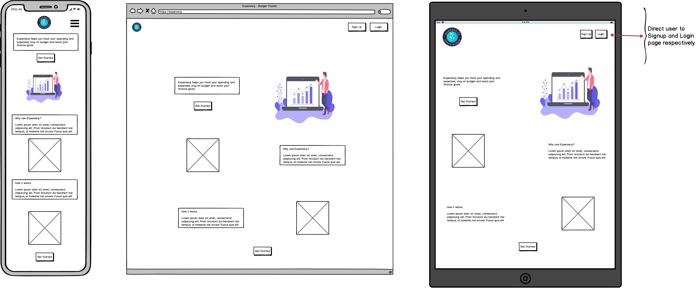

<strong>Sign up</strong>

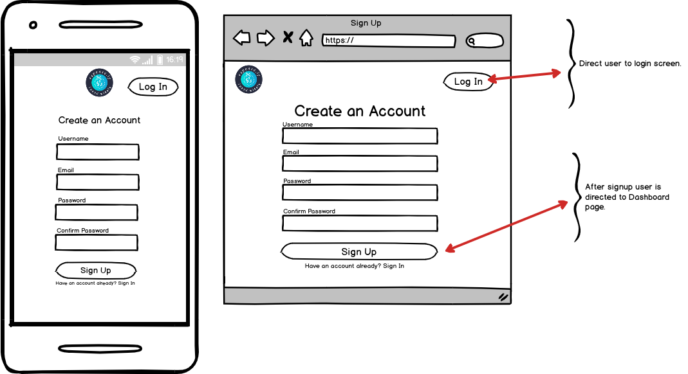

<strong>Login</strong>

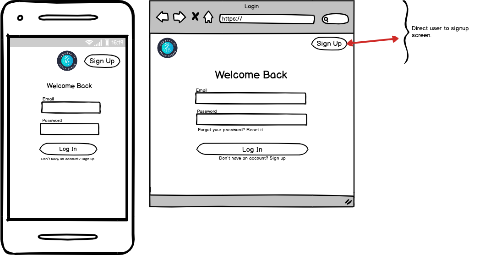

<strong>Dashboard</strong>

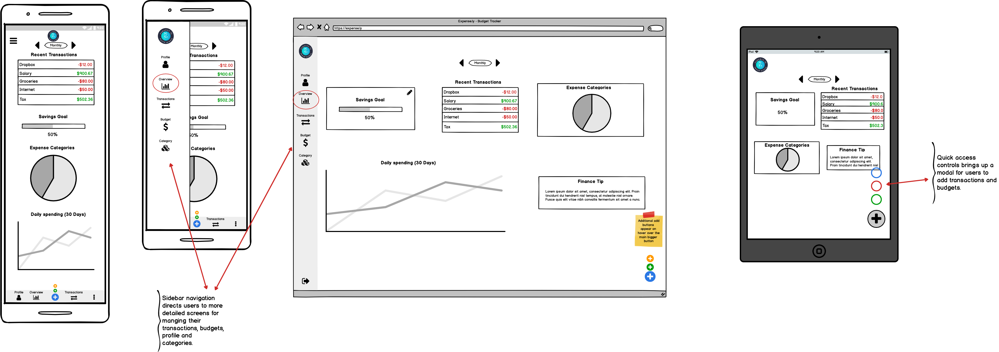

<strong>Transactions</strong>

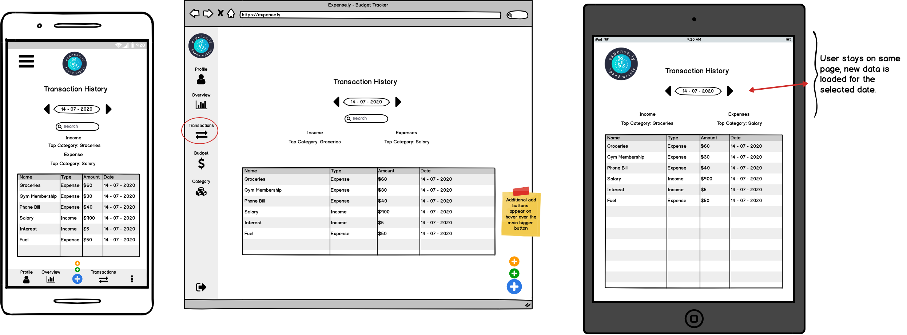

<strong>View all budgets</strong>

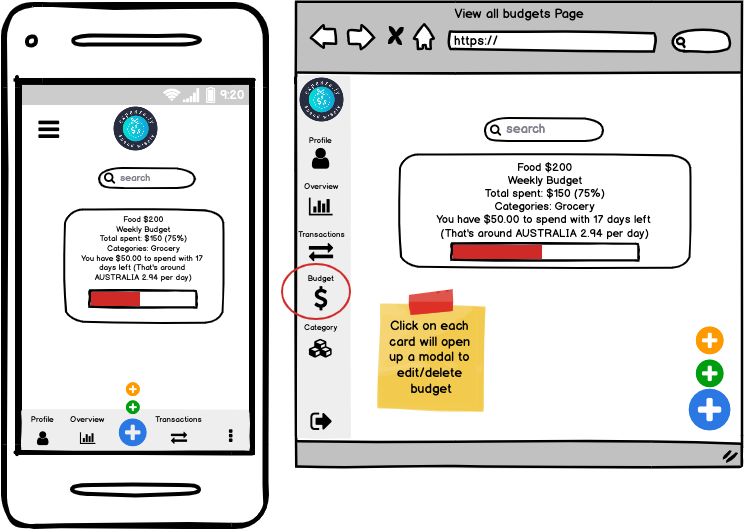

<strong>View all categoriess</strong>

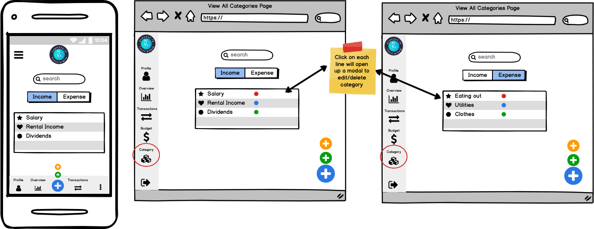

<strong>Profile settings</strong>

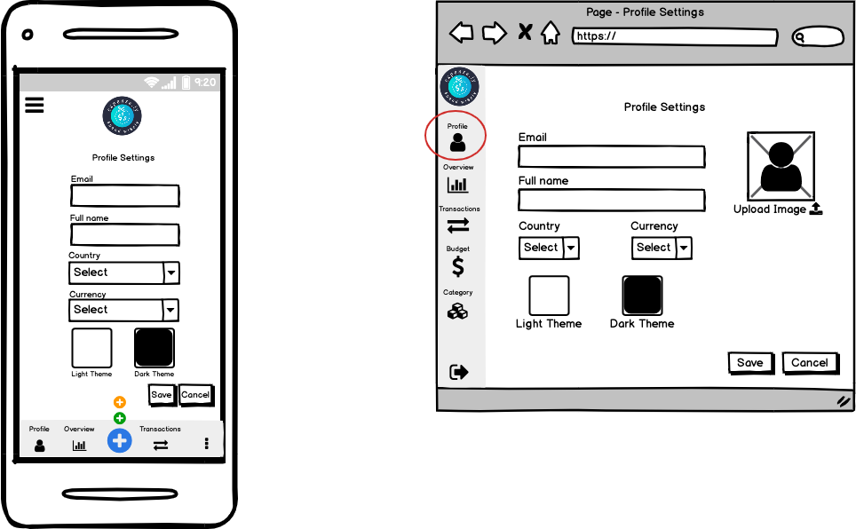

<strong>Modals for adding/editing/deleting transactions</strong>

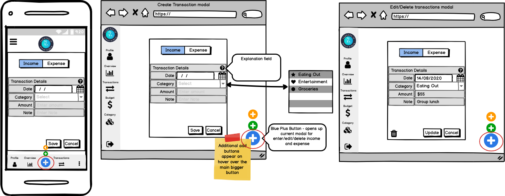

<strong>Modals for adding/editing/deleting categories</strong>

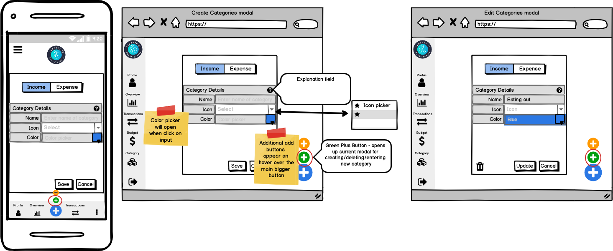

<strong>Modals for adding/editing/deleting budgets</strong>

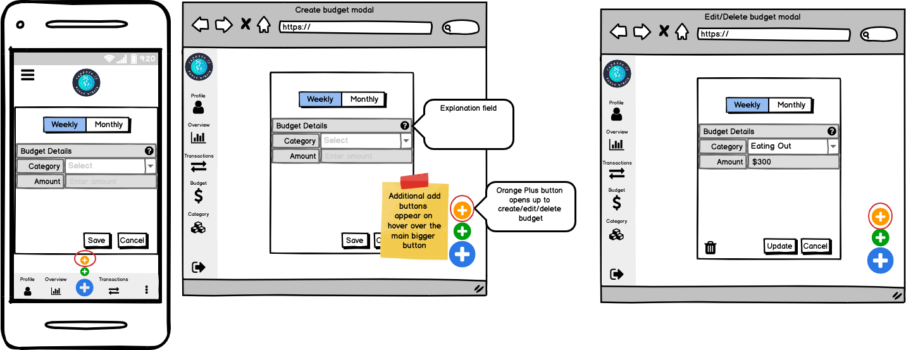

<h2>Project Management</h2>

### Part A - Planning

For project management we have utilised Trello for task management. Our project management process has involved:

- Delegating tasks using Trello's member feature.
- Planning tasks deadlines based on priority using Trello's calendar and due date features.
- Sharing resources related to tasks using Trello's commenting and description features.
- Grouping tasks based on their categories using labels.
- Set up our workflow with the following stages:
  - To Do
  - Doing
  - Done
  - On Hold

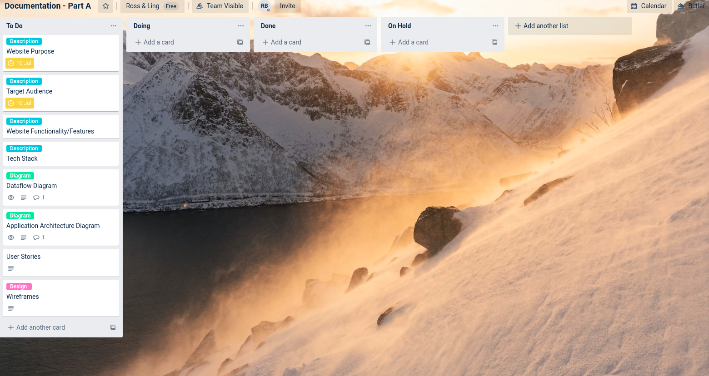

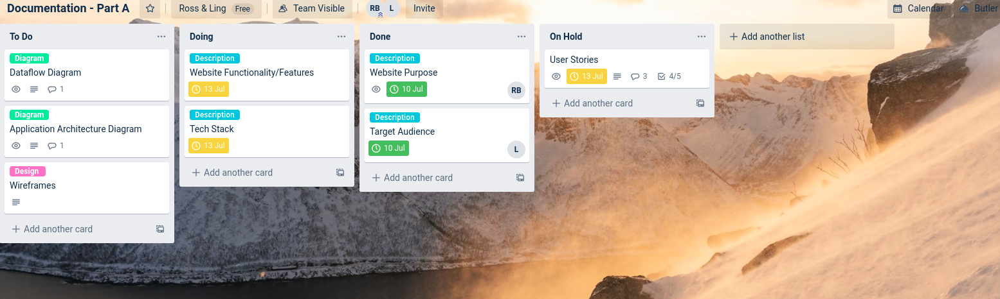

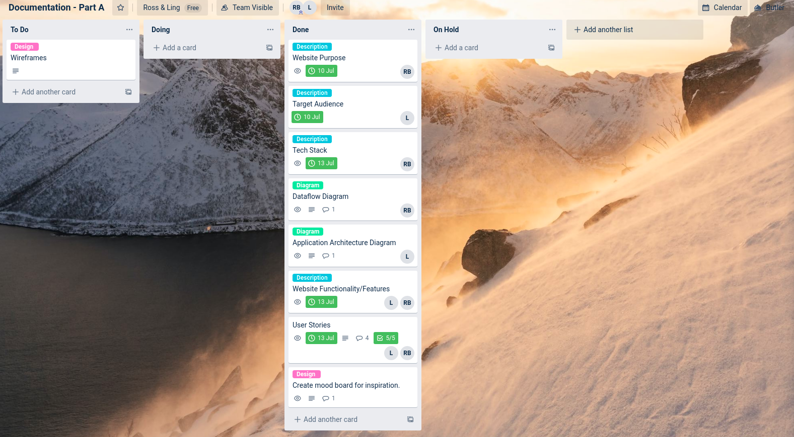

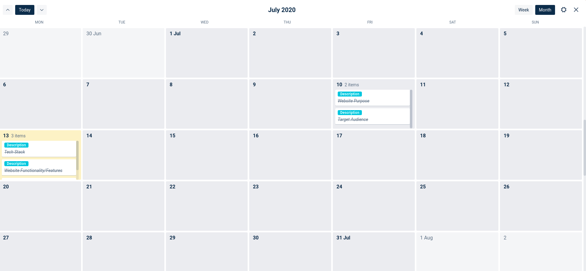

### Part B - Development

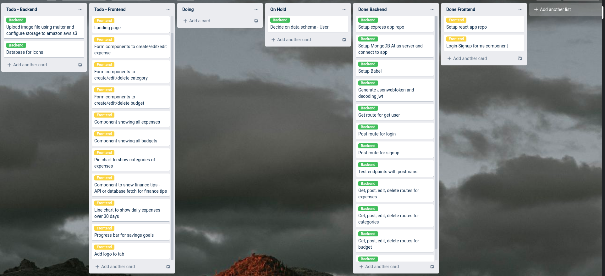

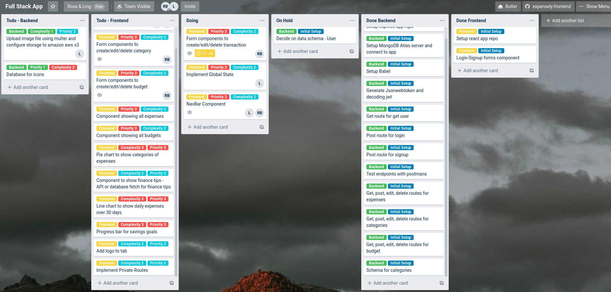

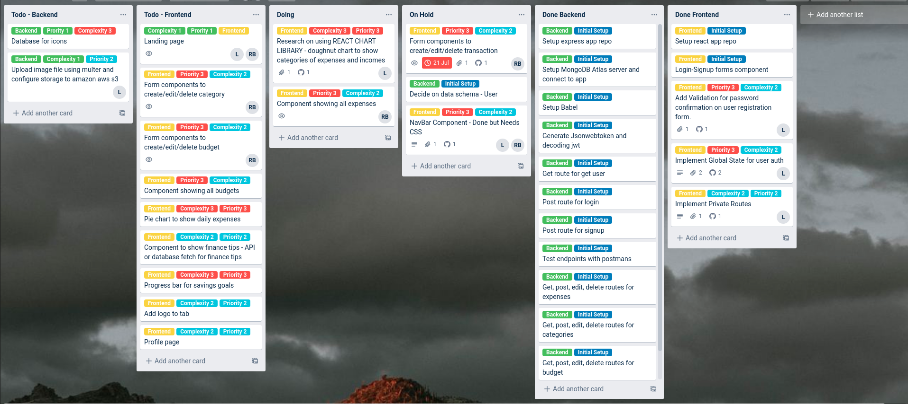

<h1>Presentation slidedeck - Part A</h1>

<object data="docs/presentation-slides.pdf" type="application/pdf" width="700px" height="700px">
    <embed src="docs/presentation-slides.pdf">
        
This browser does not support PDFs. Please download the PDF to view it: <a href="docs/presentation-slides.pdf">Download PDF</a>.

    </embed>
</object>

## Presentation slidedeck - Part B

// TODO